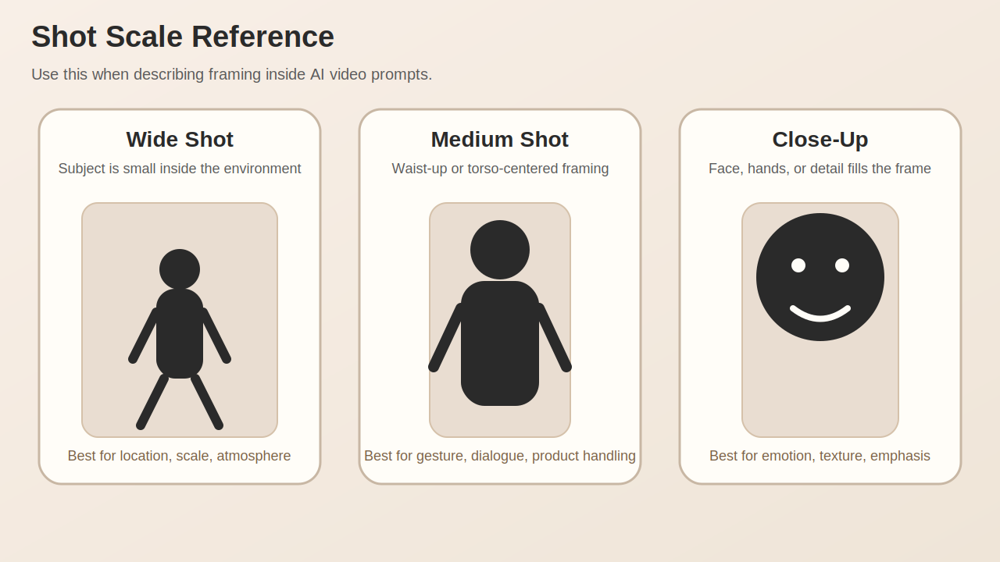

# How to Describe Shot Composition and Camera Movement in AI Video Prompts

AI video models respond far better to camera language than to vague taste language. Instead of asking for a "beautiful cinematic scene," you usually get stronger results when you specify **what is in frame, how far the camera is, what lens feeling you want, and how the shot moves**.

For people-centered scenes, the most important variables are `shot size`, `camera angle`, `lens feel`, `movement`, `lighting`, and `mood`.

Here is the basic shot-scale reference used in this article.



## Why composition language matters

These prompts are not equal:

- `a woman in a cafe`
- `medium shot of a woman in a cafe, 50mm lens, shallow depth of field`
- `slow push-in close-up, warm window light, intimate cinematic mood`

The first line names a subject and a place. The later lines describe **how the scene should be filmed**. That difference is usually what makes an AI video output feel generic versus intentional.

## The 5 variables to lock first

Build prompts in this order:

1. **Subject**: who or what is on screen
2. **Shot size**: wide, medium, close-up
3. **Angle and lens**: eye-level, low angle, overhead / 24mm, 50mm, 85mm
4. **Movement**: static, pan, tilt, dolly in, tracking shot, handheld
5. **Lighting and mood**: soft daylight, neon backlight, foggy blue atmosphere

If these are missing, the model has too much room to improvise.

## How to turn shot size into prompt language

### 1. Wide shot

Wide shots are best when environment and scale matter.

Example phrases:

- `wide shot of a lone director standing on a rain-soaked rooftop`
- `establishing shot of a small film crew in a narrow alley`
- `full-body wide frame with dramatic skyline in the background`

When you use a wide shot, add one more line about the setting. Otherwise the model may keep the frame wide but leave the world underdescribed.

### 2. Medium shot

Medium shots are the most useful default. They hold face, gesture, and context at the same time.

Example phrases:

- `medium shot of a creator adjusting a camera rig`
- `waist-up framing, confident posture, direct eye line`
- `medium tracking shot as the subject walks through a studio set`

Explainers, interviews, tutorials, and product handling scenes often perform best in medium framing.

### 3. Close-up

Close-ups are ideal for emotion, texture, and emphasis. They benefit from short mood context so the frame does not feel empty.

Example phrases:

- `close-up of focused eyes reflecting monitor light`
- `tight close-up on hands turning the focus ring`
- `slow push-in close-up, subtle emotional tension`

## Use one main camera movement at a time

A common mistake is stacking movements that compete with each other.

Bad example:

`drone shot, dolly in, handheld, spinning camera, fast zoom, cinematic`

Better examples:

- `slow dolly in`
- `smooth left-to-right tracking shot`
- `locked-off tripod shot`
- `gentle handheld sway`

Pick **one core movement**, then adjust its speed or texture.

## Lens language helps stabilize results

You do not always need exact focal lengths, but they often improve consistency.

| Goal | Prompt language | Effect |
| --- | --- | --- |
| Show more environment | `24mm wide lens` | space, distortion, energy |
| Natural portrait framing | `50mm lens` | balanced and neutral |
| Emotional portrait detail | `85mm portrait lens` | compression and subject separation |

A practical combination looks like this:

`medium close-up, 85mm portrait lens, soft backlight, slow push-in`

## The most useful prompt formula

This structure works well for first drafts:

```text
[subject] + [action] + [shot size] + [camera angle] + [lens] + [movement] + [lighting] + [background mood] + [texture/quality]
```

Example:

```text
A fashion director reviewing a storyboard wall, medium shot, eye-level angle, 50mm lens, slow lateral tracking shot, soft daylight from large studio windows, minimal industrial set, cinematic realism, fine fabric detail, subtle depth of field
```

## 5 ready-to-use prompt examples

### Interview style

```text
A founder speaking calmly in a creative studio, medium shot, eye-level angle, 50mm lens, locked-off tripod shot, soft key light with gentle shadow falloff, modern workspace in the background, clean documentary look
```

### Product demonstration

```text
Hands demonstrating a compact cinema camera, close-up, slight top-down angle, 85mm macro feel, slow push-in, crisp controlled studio lighting, matte black tabletop, premium commercial texture
```

### Trailer-style scene

```text
A lone character stepping into a foggy warehouse, wide shot, low angle, 24mm lens, slow forward dolly, cold blue backlight, floating dust, dramatic cinematic scale
```

### Vlog energy

```text
A creator entering a neon-lit editing room, medium handheld shot, eye-level, 35mm lens, gentle natural handheld motion, practical monitor light and magenta accent glow, energetic but grounded mood
```

### Emotion-first insert

```text
Close-up of a director pausing before the shoot begins, eye-level, 85mm lens, subtle push-in, soft side light, shallow depth of field, quiet tension, cinematic realism
```

## Failure patterns to avoid

- **Too many adjectives, not enough camera direction**
  `beautiful cinematic masterpiece` adds almost no useful control.
- **Conflicting shot logic**
  Combinations like `extreme close-up drone shot` usually weaken results.
- **Abstract lighting**
  `nice lighting` is weak. `warm sunset rim light` is better.
- **No scene purpose**
  Decide whether the shot is for scale, emotion, product detail, or character behavior.

## You can add images and videos to these articles

This site can carry media references inside the article itself.

Image embed:

```md
![[en/blog/media/reference-board.jpg|1200]]
```

Local video embed:

```md
![[en/blog/media/camera-move-demo.mp4]]
```

YouTube embed:

```md

```

That means a page can function as a full **prompt guide + visual board + motion reference sheet**, not just plain text.

## Final takeaway

Shot composition is not a decorative add-on in AI video prompting. It is one of the main control layers. If the model only knows your subject, it will improvise the camera. If you specify framing, angle, lens, and movement, the output becomes much more coherent.

A simple rule is enough to improve most prompts:

- define the shot size
- define the angle
- define the lens feel
- define the movement

Once those four are clear, your prompt starts to behave like direction instead of wishful description.
